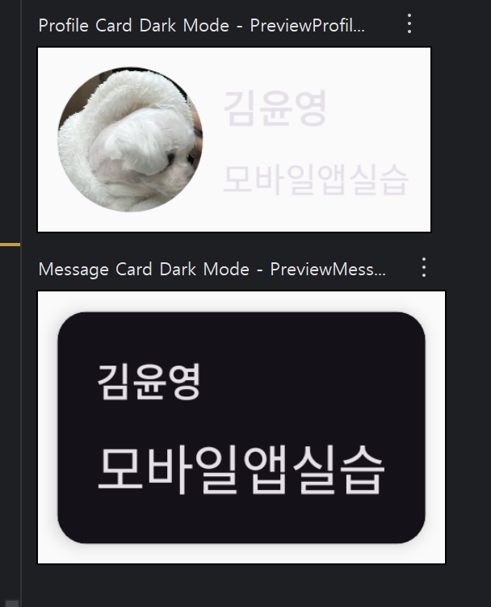
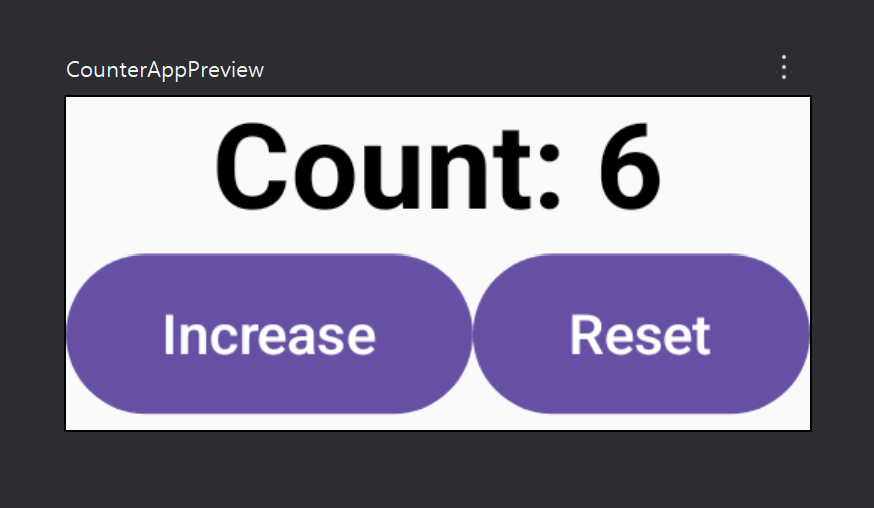
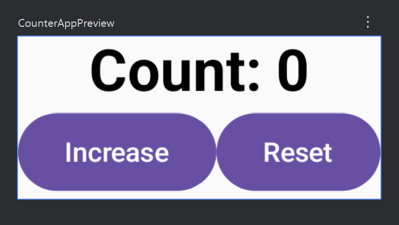
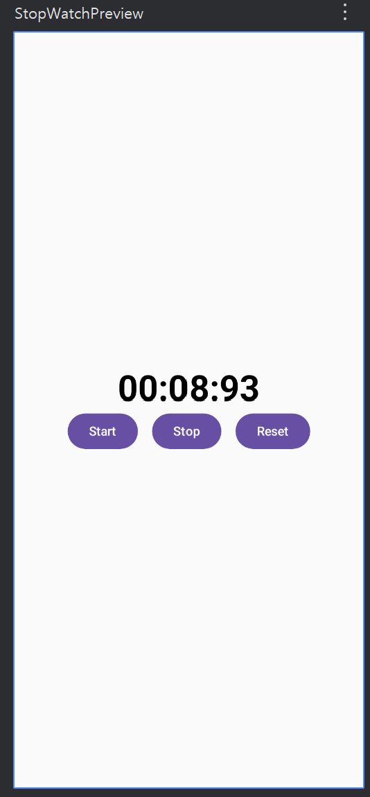
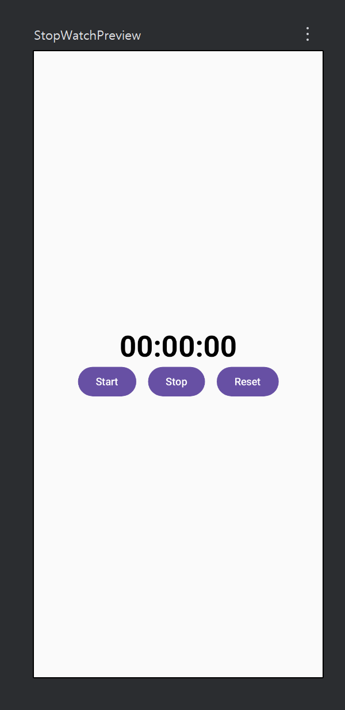

# androidapp

### w03

처음 작업한 파일

글을 원하는 크기와 색으로 넣고 사진과 함께 화면을 꾸밈.

버튼을 눌러서 실행되는 것은 없음. (단순 디자인용)

### w04

사진을 동그랗게 올리고 설명써서 프로필 만들기.

다크모드 사용

### w05

1. Increase를 누를때마다 count의 숫자가 하나씩 오르고

reset을 눌렀을 때 0으로 초기화

2. start를 누르면 10밀리초 단위로 숫자가 올라가고

stop을 누르면 중지, reset을 누르면 다시 00:00:00으로 초기화

