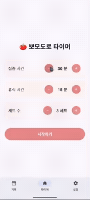
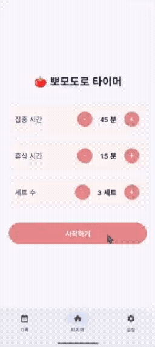
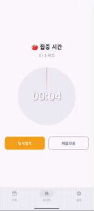
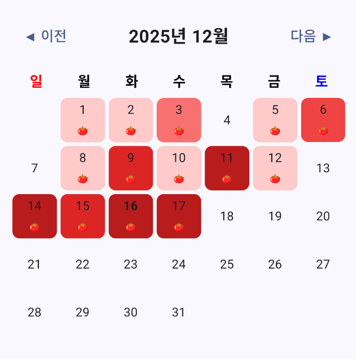
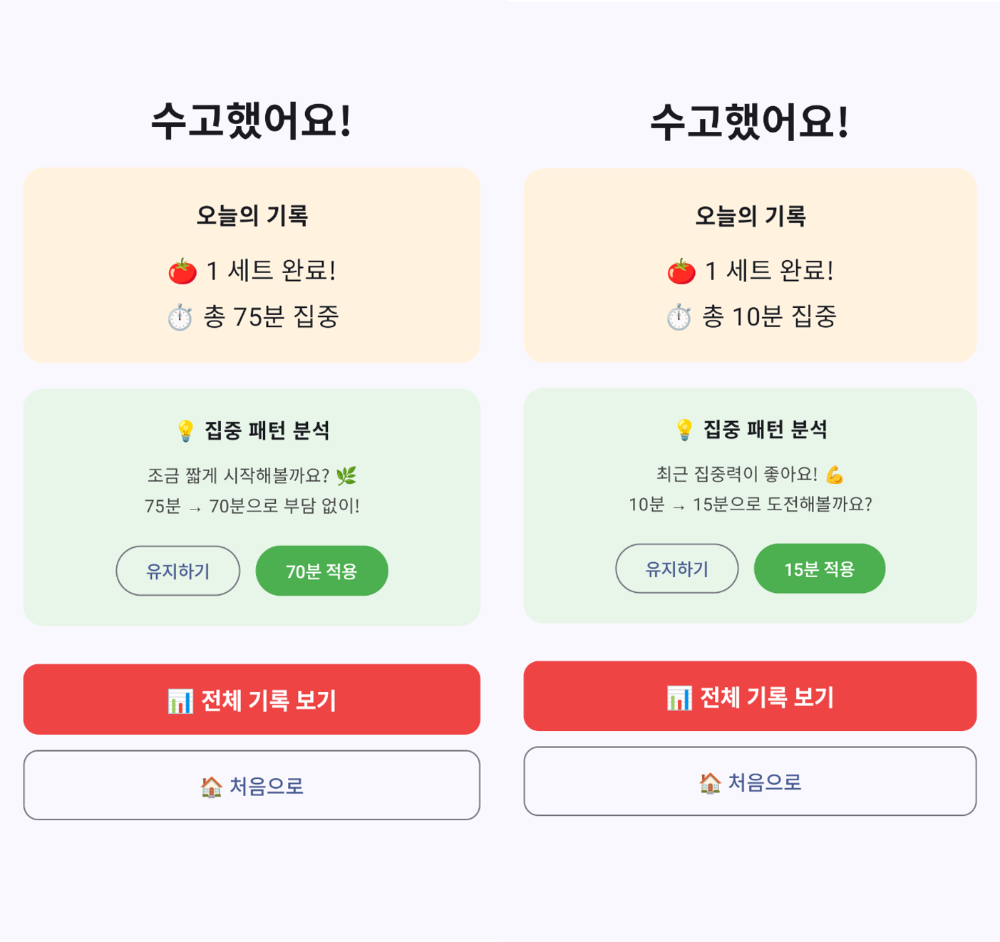
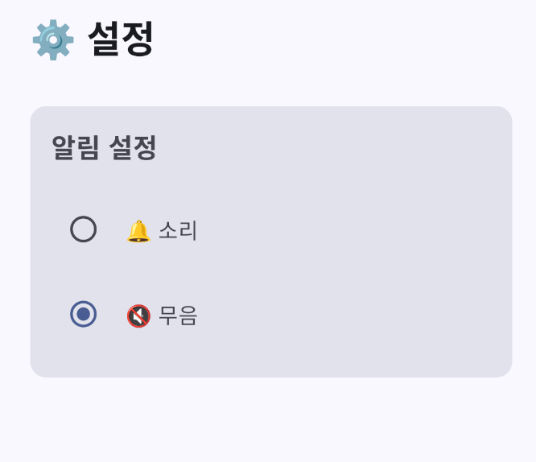

# androidapp

### w03

처음 작업한 파일

글을 원하는 크기와 색으로 넣고 사진과 함께 화면을 꾸밈.

버튼을 눌러서 실행되는 것은 없음. (단순 디자인용)

### w04

사진을 동그랗게 올리고 설명써서 프로필 만들기.

다크모드 사용

### w05

1. Increase를 누를때마다 count의 숫자가 하나씩 오르고

   reset을 눌렀을 때 0으로 초기화

2. start를 누르면 10밀리초 단위로 숫자가 올라가고

  stop을 누르면 중지, reset을 누르면 다시 00:00:00으로 초기화
  

> PS: 기존 스톱워치 코드는 10밀리초 딜레이 후 10씩 증가하는 방식이었으나, 실제 시간과 오차가 발생하여 chatgpt의 도움으로 시스템 시간을 기반으로 카운트하도록 변경함.

### w06

버블게임

랜덤하게 생성되는 버블을 클릭하여 점수를 올리는 게임

게임시간 60초

일정시간 후 버블 자동 사라짐

버블 클릭시 점수 증가 및 해당 버블 제거

제한시간 종료 후 최종 점수 표시

> ※ 중간 반복 구간 생략 후 시작과 끝부분 연결

---

### project - 뽀모도로 타이머 (기말 프로젝트)

기말과제로 만든 뽀모도로 타이머 앱

평소에 아날로그 뽀모도로 타이머를 쓰고 있었는데, 디지털로만 가능한 기능을 추가해서 만들어봄

#### 타이머 설정

집중 시간 (5-120분), 휴식 시간 (5-60분), 세트 수 (1-10세트) 설정 가능

+/- 버튼으로 5분 단위로 조절

#### 타이머 실행

원형 타이머로 남은 시간 표시

집중 시간 끝나면 자동으로 휴식 시간으로 전환

일시정지 / 재개 / 처음으로 돌아가기 가능

#### 휴식 시간

휴식 시간에는 초록색으로 표시

휴식 건너뛰기 버튼으로 바로 다음 세트 시작 가능

#### 기록 확인

이번 주 공부량 막대그래프로 표시

달력에서 날짜별 공부 기록 확인 가능

날짜 클릭하면 해당 날짜의 세트 수, 총 집중 시간 팝업으로 표시

공부량에 따라 달력 색이 달라짐

<ul>
  <li>
    
    <code>#B91C1C</code> - 4시간 이상
  </li>
  <li>
    
    <code>#DC2626</code> - 3시간 이상
  </li>
  <li>
    
    <code>#EF4444</code> - 2시간 이상
  </li>
  <li>
    
    <code>#F87171</code> - 1시간 이상
  </li>
  <li>
    
    <code>#FECACA</code> - 1시간 미만
  </li>
</ul>

#### 패턴 분석

모든 세트 완료 후 최근 7일 기록 분석

평균 세트 수가 3 이상이면 시간 늘리기 추천

평균 세트 수가 2 미만이면 시간 줄이기 추천

추천 시간 바로 적용하거나 유지하기 선택 가능

#### 알림 설정

소리 / 무음 선택 가능

#### 사용한 기술

- Jetpack Compose - UI 구현
- Room Database - 공부 기록 저장
- DataStore - 설정값 저장
- ToneGenerator - 알림 소리
