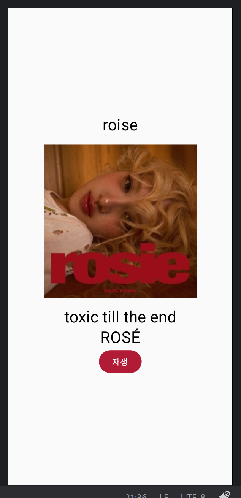
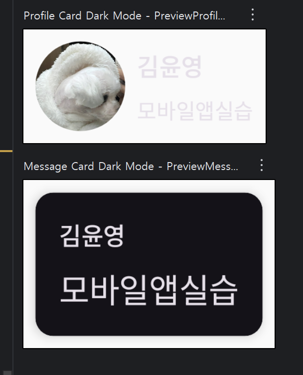
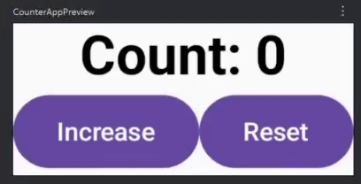
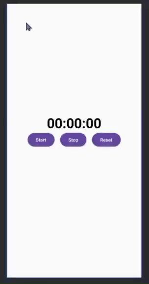
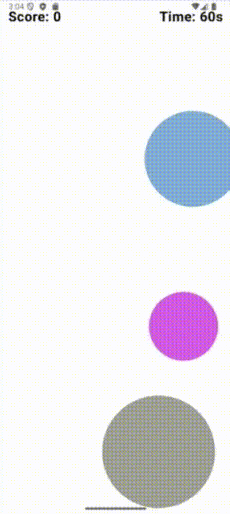

# androidapp

### w03

처음 작업한 파일

글을 원하는 크기와 색으로 넣고 사진과 함께 화면을 꾸밈.

버튼을 눌러서 실행되는 것은 없음. (단순 디자인용)

### w04

사진을 동그랗게 올리고 설명써서 프로필 만들기.

다크모드 사용

### w05

1. Increase를 누를때마다 count의 숫자가 하나씩 오르고

   reset을 눌렀을 때 0으로 초기화

2. start를 누르면 10밀리초 단위로 숫자가 올라가고

  stop을 누르면 중지, reset을 누르면 다시 00:00:00으로 초기화
  

> PS: 기존 스톱워치 코드는 10밀리초 딜레이 후 10씩 증가하는 방식이었으나, 실제 시간과 오차가 발생하여 chatgpt의 도움으로 시스템 시간을 기반으로 카운트하도록 변경함.

#### w06

버블게임

랜덤하게 생성되는 버블을 클릭하여 점수를 올리는 게임

게임시간 60초

일정시간 후 버블 자동 사라짐

버블 클릭시 점수 증가 및 해당 버블 제거

제한시간 종료 후 최종 점수 표시

> ※ 중간 반복 구간 생략 후 시작과 끝부분 연결
